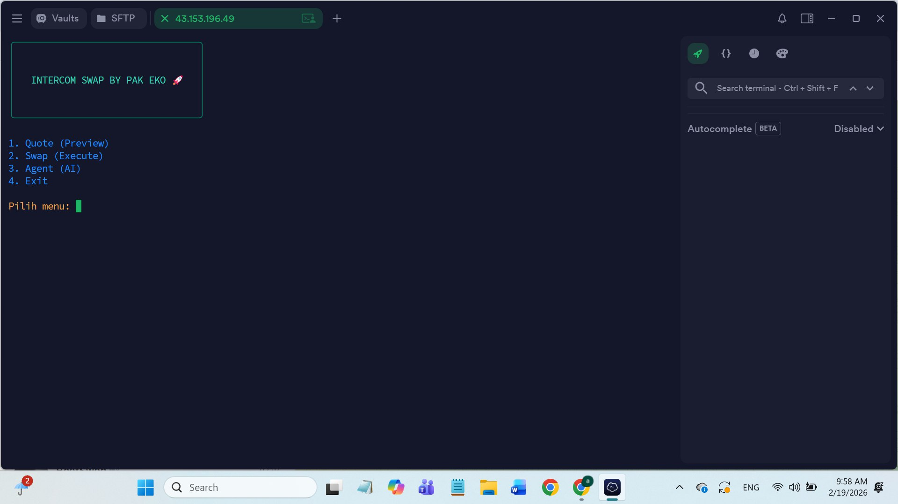
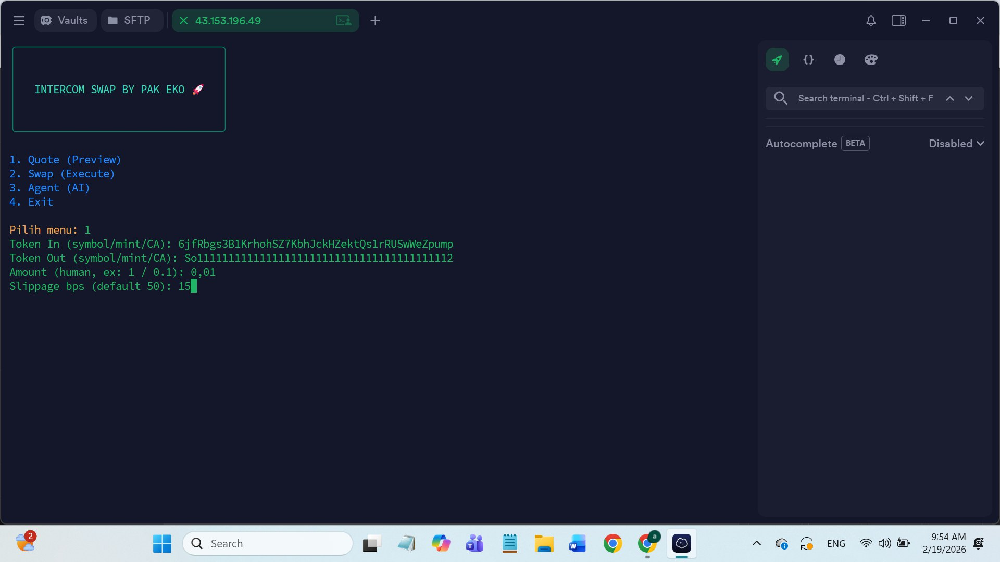
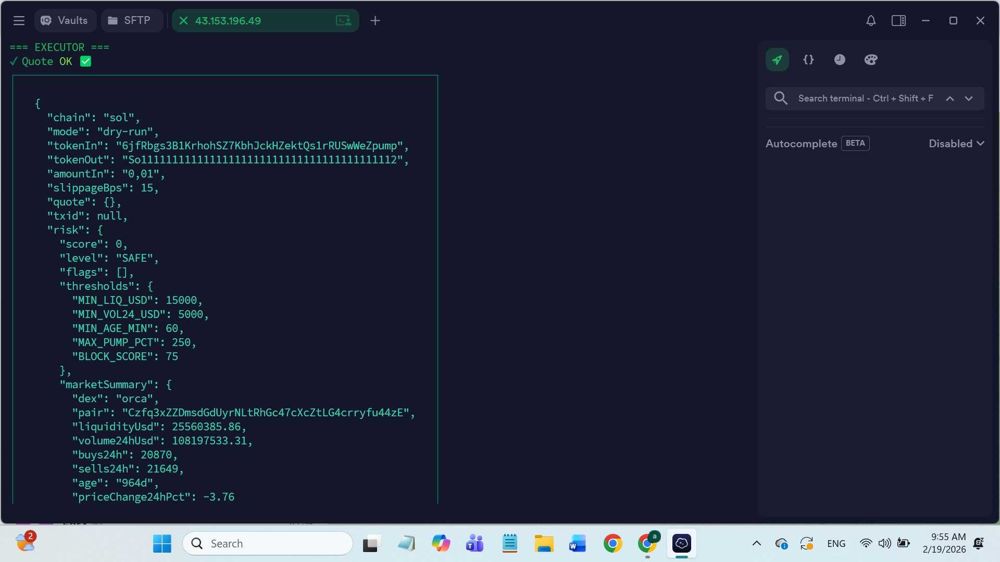
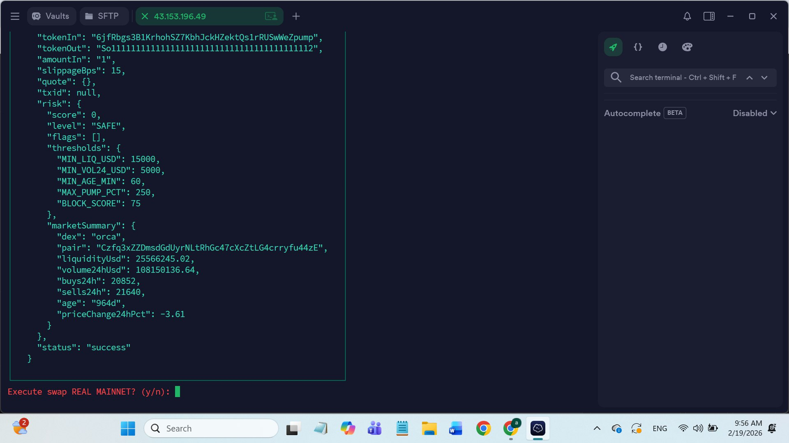

# 🧠 INTERCOM SWAP BY PAK EKO 🚀

CLI-based **AI Multi-Agent Swap Engine**  
🔥 REAL swap on MAINNET 
🔥 Dexscreener-powered analysis  
🔥 Risk engine + Agent pipeline  

---

## 📍 TRAC ADDRESS

```
trac1jwh8vrc50x7r8ysfx0v7d2k2qlkv999zkjl5w6sg7rktmmf6qhysp3w76d
```

---

## ⚡ OVERVIEW

INTERCOM SWAP BY PAK EKO is a CLI tool designed for:

- 💱 Real on-chain token swaps (MAINNET)
- 🤖 Multi-agent execution pipeline:
  - Scout → intent parsing
  - Analyst → market analysis (Dexscreener)
  - RiskGate → safety checks
  - Executor → on-chain swap
- 📊 Real-time token analysis
- 🛡️ Built-in risk scoring system

---

## 🧠 AGENT PIPELINE

```
USER INPUT
   ↓
Scout (parse intent)
   ↓
Analyst (Dexscreener data)
   ↓
RiskGate (liquidity, volume, age, etc)
   ↓
Executor (Jupiter swap → MAINNET)
```

---

## 🚀 FEATURES

- ✅ CLI UI (Pro Max Interactive)
- ✅ Real swap via Jupiter Aggregator
- ✅ Token CA / Mint support
- ✅ Dexscreener integration
- ✅ Risk scoring engine
- ✅ Dry-run preview before execution
- ✅ AI-style agent workflow

---

## 📦 INSTALLATION

### 1. Clone repository
```bash
git clone https://github.com/pakeko78/intercom-swap-by-pakeko
cd intercom-swap-by-pakeko
```

### 2. Install dependencies
```bash
npm install
```

---

## ⚙️ ENV SETUP

```bash
cp .env.example .env
nano .env
```

Fill this:

```
SOL_PRIVATE_KEY=YOUR_PRIVATE_KEY
SOL_RPC=https://api.mainnet-beta.solana.com
```

---

## 🔐 PRIVATE KEY FORMAT

Supported formats:

- ✅ Base58 string
- ✅ JSON array (Solana format)

⚠️ SECURITY WARNING:
- NEVER use your main wallet
- Always use burner wallet

---

## ▶️ RUN CLI

```bash
npm run cli
```

or:

```bash
node src/cli/index.js
```

---

## 🎮 CLI MENU

```
1. Quote (Preview)
2. Swap (Execute)
3. Agent (AI)
4. Exit
```

---

## 📊 EXAMPLE: QUOTE

Input:
```
Token In  : USDC
Token Out : SOL
Amount    : 1
```

Output:
```json
{
  "chain": "sol",
  "mode": "dry-run",
  "tokenIn": "USDC",
  "tokenOut": "SOL",
  "amountIn": "1",
  "slippageBps": 50,
  "status": "success"
}
```

---

## 💸 EXAMPLE: REAL SWAP

```
Execute swap REAL MAINNET? (y/n): y
```

Output:
```json
{
  "txid": "xxxxx",
  "status": "success"
}
```

---

## 🤖 AGENT MODE

Example:

```
swap 1 usdc to sol
```

Agent will automatically:

- Parse intent
- Fetch Dexscreener data
- Evaluate risk
- Execute swap

---

## 🧠 TOKEN INPUT FORMAT

You can use:

- Symbol → `USDC`, `SOL`
- Mint → `EPjFWdd5...`
- CA → `0x...` (EVM future support)

---

## ⚠️ IMPORTANT

### SOL MINT ADDRESS

```
So11111111111111111111111111111111111111112
```

---

## 📸 PROOF (LIVE EXECUTION)

> Below are real CLI execution results and swap pipeline outputs:






---

## 🚨 TROUBLESHOOTING

### ❌ Empty quote
- Invalid token
- Wrong mint
- RPC issue

### ❌ Swap failed
- Insufficient balance
- Low liquidity
- Slippage too low

### ❌ "bad secret key"
- Wrong private key format

---

## 🖥️ VPS REQUIREMENTS

Minimum:

- 2 GB RAM
- Node.js v18+

Recommended:

- 4 GB RAM
- Node.js v20+

---

## 🔥 ROADMAP

- [ ] EVM swap (0x / Uniswap)
- [ ] Auto token detection (Dexscreener search)
- [ ] Copy trading
- [ ] Sniper mode 😈

---

## 👑 AUTHOR

**PAK EKO INTERCOM ENGINE**

---

## 🚀 FINAL NOTE

> This tool executes REAL on-chain swaps.  
> Use at your own risk ⚠️
